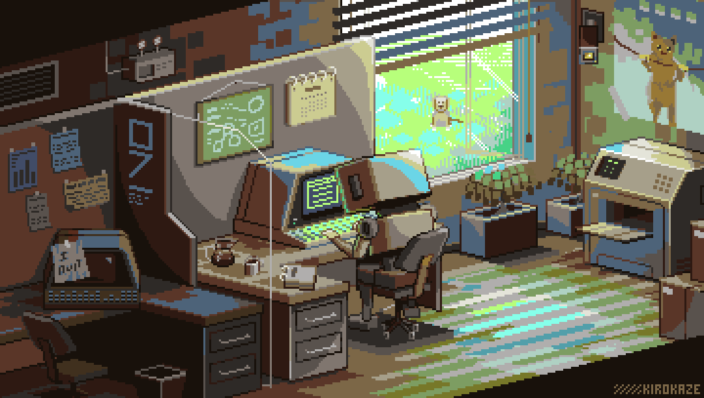

<h1 align="center">Hi, I'M Xollll👋</h1>

 
# 💫 About Me:
🔭 I'm currently working on building my skills as a Software Engineering        student with a focus on both full-stack web and mobile development.  🤝 I'm looking for help with best practices for structuring large-scale        applications and advanced Flutter techniques.  🌱 I’m currently learning Flutter, to become a full-stack mobile developer        in addition to my web development pursuits.  ⚡ Fun fact : I love being creative in all my projects—whether it’s a new feature        or a slick UI design!

---

<!-- Proudly created with GPRM ( https://gprm.itsvg.in ) -->
