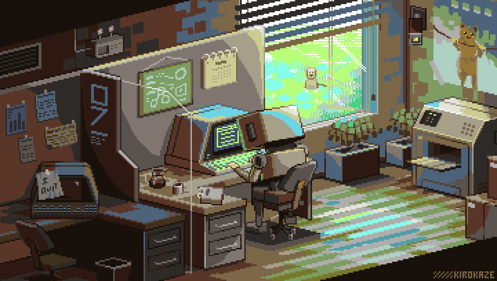

  

  

  

 

<picture>
  <source media="(prefers-color-scheme: dark)" srcset="https://raw.githubusercontent.com/Xollll/Xollll/output/github-snake-dark.svg" />
  <source media="(prefers-color-scheme: light)" srcset="https://raw.githubusercontent.com/Xollll/Xollll/output/github-snake.svg" />
  
</picture>

---

💻 Interested in **software development, automation, web applications, and emerging technologies**.

🌶️ Built **AgriSenseAI**, my FYP project using **YOLOv8, Raspberry Pi, Flutter, and Python** to detect chilli plant diseases in real time.

🛠️ I enjoy working across different areas, from **software and backend development to AI, hardware, and real-time systems**.

🚀 Currently exploring **Python, AI, automation, and new technologies** while continuing to improve my software engineering skills.

💡 Always learning, experimenting, and building something new.

---

<!-- Proudly created with GPRM ( https://gprm.itsvg.in ) -->
